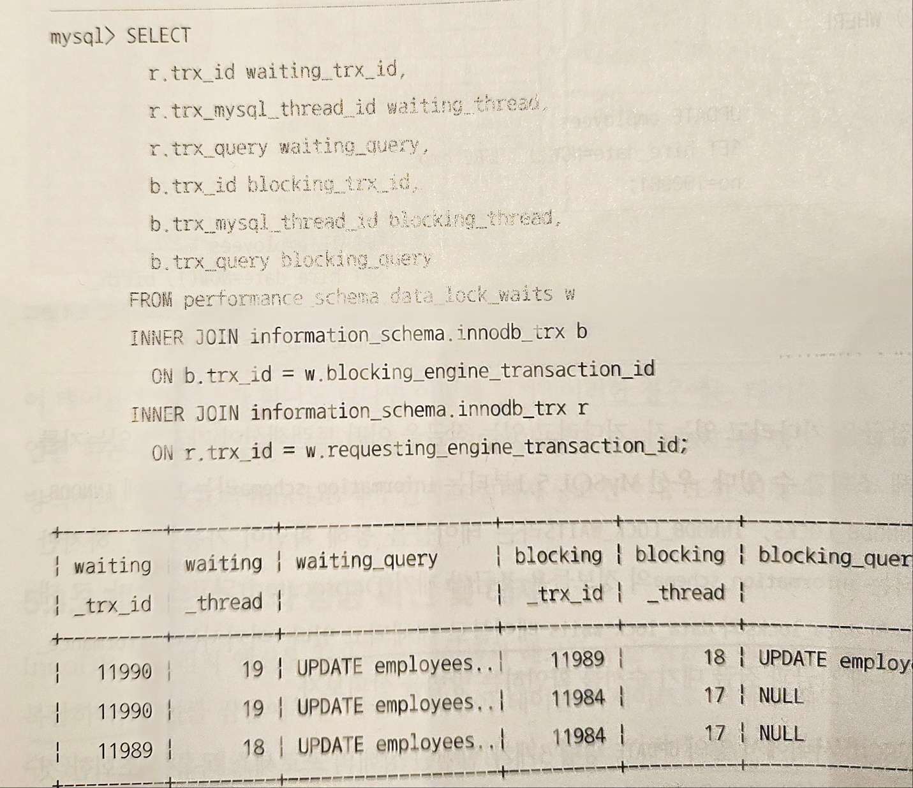
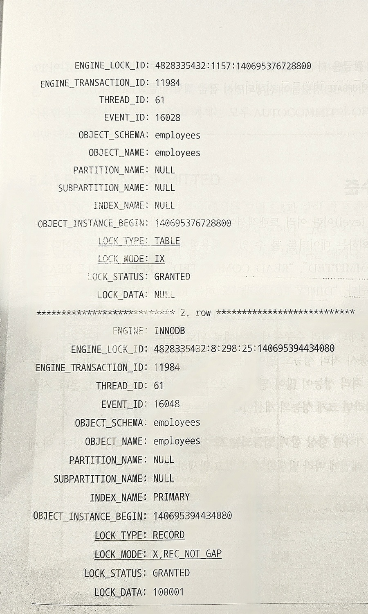

# 5.3 InnoDB 스토리지 엔진 잠금

InnoDB 스토리지 엔진은 Mysql에서 제공하는 잠금과는 별개로 스토리지 엔진 내부에 레코드 기반의 잠금 방식을 탑재하고 있다.


Mysql 서버의 information_schema 데이터베이스에 존재하는 INNODB_TRX, INNODB_LOCKS, INNODB_LOCK_WAITS 테이블을 조인하여 조회시 현재 어떤 트랜잭션이 어떤 잠금을 대기하고있고, 해당 잠금을 어느 트랜잭션이 가지고 있는지 알 수 있다.

### 5.3.1 InnoDB 스토리지 엔진의 잠금
* InnoDB 스토리지 엔진은 레코드 기반의 잠금 기능을 제공하며, 잠금 정보가 상당히 작은 공간으로 관리되어 락 에스컬레이션이 발생하지 않는다.
* 레코드와 레코드 사이의 간격을 잠그는 갭(GAP) 락이 존재한다.

#### 5.3.1.1 레코드 락
레코드 자체만을 잠그는 락
* InnoDB의 레코드 락은 인덱스의 레코드를 잠근다

    -> 인덱스가 없더라도 내부적으로 자동 생성된 클러스터 인덱스를 이용하여 잠금

* 프라이머리 키, 유니크 인덱스에 의한 변경작업에 대해서는 레코드 자체에 대해서만 잠금을 건다.

#### 5.3.1.2 갭 락
레코드와 인접한 레코드 사이의 간격만을 잠그는 락

레코드와 레코드 사이에 새로운 레코드가 생성(INSERT)되는것을 막는다.

#### 5.3.1.3 넥스트 키 락
레코드 락과 갭 락을 합쳐놓은 형태의 잠금

InnoDB의 갭 락이나 넥스트 키 락은 바이너리 로그에 기록되는 쿼리가 레플리카 서버에 실행될 때 소스 서버에서 만들어 낸 결과와 동일한 결과를 만들어내도록 보장하는 것이 주 목적이다. 

가능하다면 바이너리 로그 포맷을 ROW 형태로 바꾸어 넥스트 키 락이나 갭 락을 줄이는 것이 좋다

#### 5.3.1.4 자동 증가 락
AUTO_INCREMENT를 사용하는 테이블에 동시에 여러 데이터가 들어오는 경우 저장되는 각 레코드가 중복되지 않고 저장된 순서대로 증가하는 일련의 값을 가져야 한다. 

이때 사용하는 것이 AUTO_INCREMENT LOCK 라는 테이블 수준의 잠금이다.

* INSERT, REPLACE 쿼리 문장과 같이 새로운 레코드를 저장하는 쿼리에서만 필요하며, UPDATE, DELETE등의 쿼리에서는 걸리지 않는다. 
* 트랜잭션과 관련없이 INSERT, REPLACE 문장에서 AUTO_INCREMENT 값을 가져오는 순간만 락이 걸렸다가 즉시 해제된다. 
* AUTO_INCREMENT 락은 테이블에 단 하나만 존재한다.

### 5.3.2 인덱스와 잠금
InnoDB 잠금은 레코드를 잠그는 것이 아닌 인덱스를 잠근다.

-> 변경해야 할 레코드를 찾기위해 검색한 인덱스와 레코드 모두 락을 걸어야 한다.

```sql
-- // 예제 DB의 employees테이블에는 first_name에만 ix_firstname라는 인덱스가 준비되어있다.

SELECT COUNT(*) FROM employees WHERE first_name='George';
-- 253

SELECT COUNT(*) FROM employees WHERE first_name='George' AND last_name = 'Klassen';
-- 1
```

만약 `UPDATE employees SET hire_date = NOW() WHERE first_name = 'George' AND last_name = 'Klassen';`라는 UPDATE문을 실행한다면

first_name 컬럼에 인덱스가 걸려있으므로 `first_name = 'George'` 인 레코드 253건은 락이 걸릴 것이다.

만약 인덱스가 걸려있지 않은 채로 UPDATE문이 실행되면 해당 테이블에 존재하는 레코드 전체에 락이 걸리게 된다.

그러므로 UPDATE 문을 위한 인덱스가 적절하게 걸려있지 않다면 동시성이 상당히 떨어질 것이다.


### 5.3.3 레코드 수준의 잠금확인 및 해제
InnoDB의 레코드 수준의 잠금은 테이블 수준의 잠금보다는 복잡하다. 레코드 수준의 잠금은 테이블의 레코드 각각에 잠금이 걸리므로 그 레코드가 자주 사용되지 않는다면 오랜 시간동안 잠겨진 상태로 남아있을 수 있다.

Mysql8.0에서부터 각 트랜잭션이 어떤 잠금을 기다리고 있는지, 기다리고 있는 잠금을 어떤 트랜잭션이 가지고 있는지 `performance_schema`의 `data_locks`와 `data_lock_waits`로 확인할 수 있다.

아래와 같이 `performance_schema`의 `data_locks`와 `data_lock_waits`를 조인해서 확인해보면



쿼리의 실행 결과를 보면 18번 스레드는 17번을 기다리고 있고 19번은 18번을 기다리고 있는 것을 확인할 수 있다.

즉 17번이 가진 잠금을 해제하고 18번이 UPDATE 후 잠금을 19번으로 넘겨줘야 한다.

17번의 잠금을 자세히 확인해보기 위해 아래와 같은 쿼리문을 실행하면

`SELECT * FROM performance_schema.data_locks\G`

더 자세한 결과를 확인할 수 있다.



위의 결과를 확인해보면 employees 테이블에 대해 IX 잠금을 가지고 있으며 employees테이블의 특정 레코드에 대해 쓰기 잠금을 걸고 있다. 이때  REC_NOT_GAP표시가 있으므로 레코드 잠금은 갭이 포함되어 있지 않은 순수한 레코드에 대해서만 잠금을 가지고 있다는 것을 알 수 있다.

17번 스레드를 강제 종료 시키려면 `KILL 17`명령어로 죽이면 된다.

