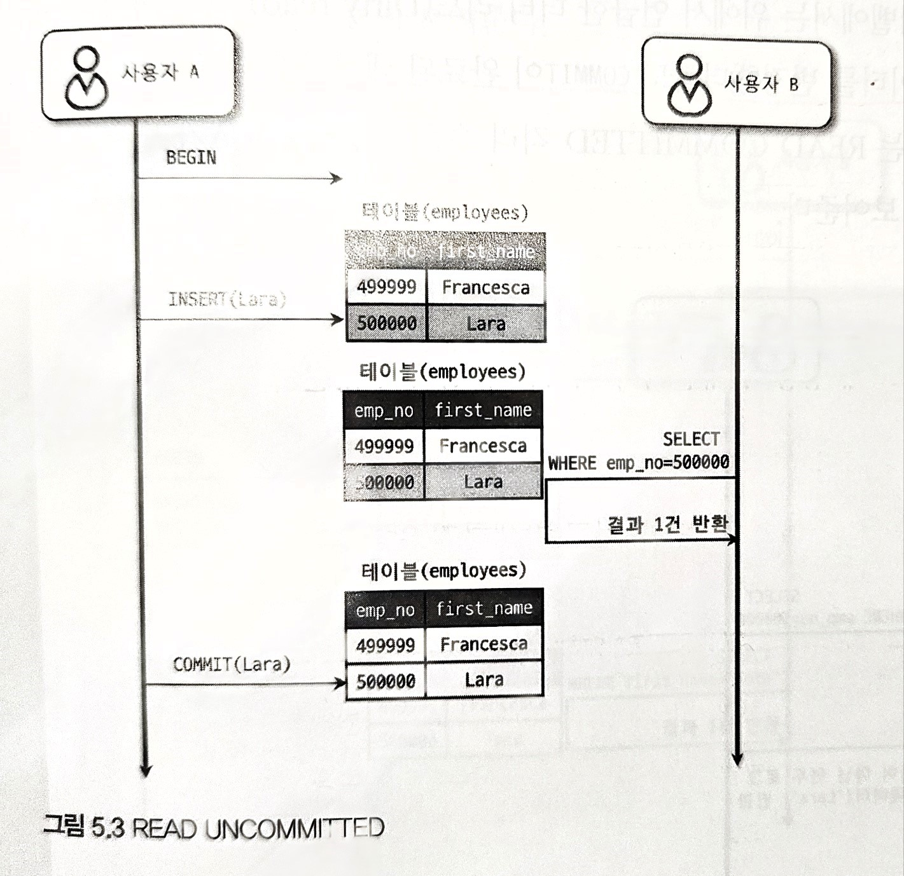
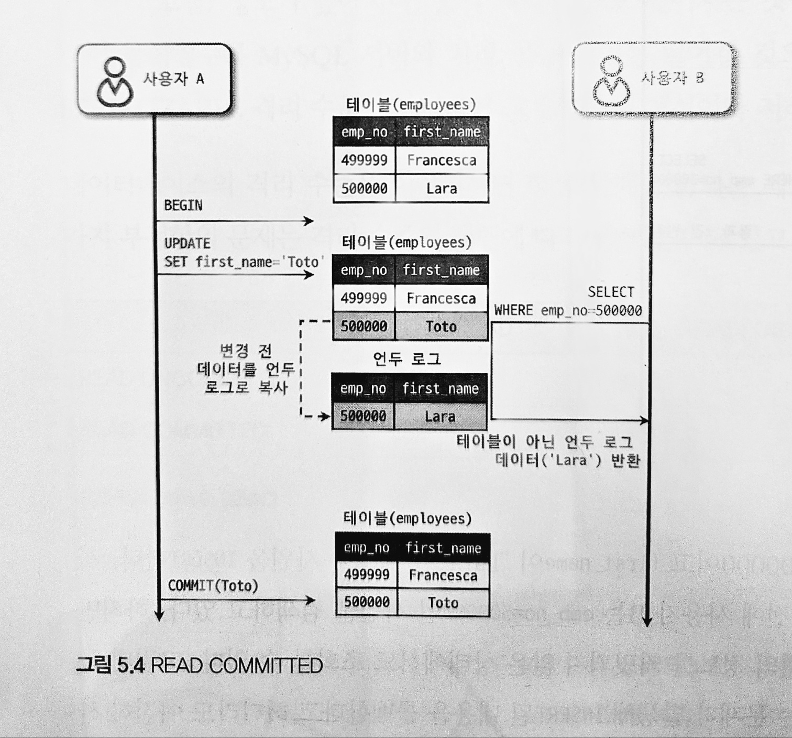
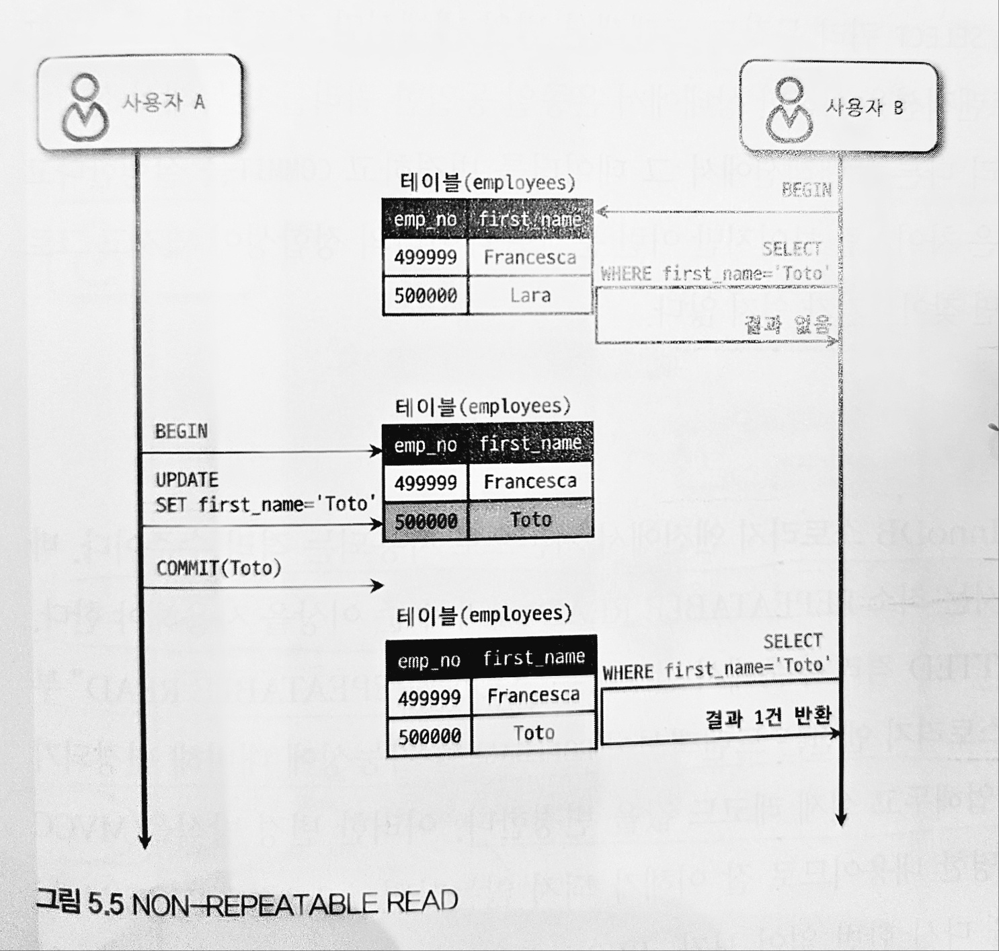
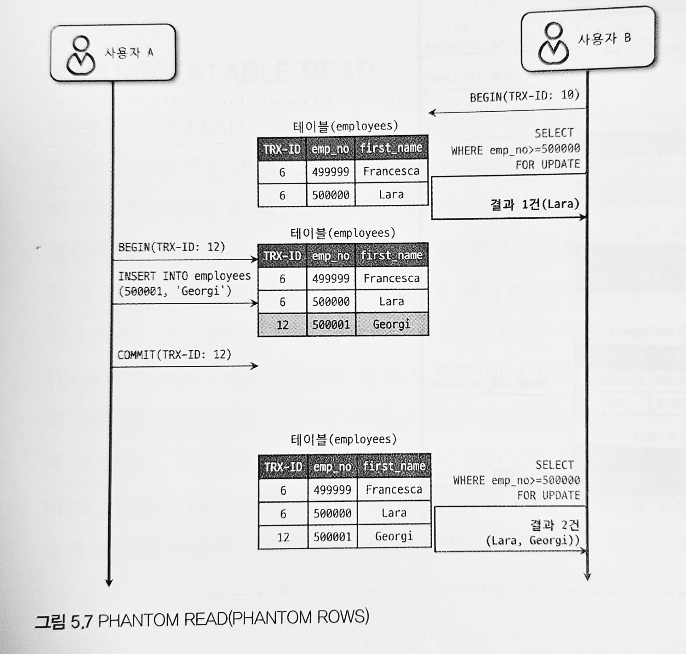

# 5.4 Mysql 격리 수준

트랜잭션의 격리수준이란 여러 트랜잭션이 동시에 처리될 때 특정 트랜잭션이 다른 트랜잭션에서 변경하거나 조회하는 데이터를 볼 수 있게 허용할지 말지 결정하는 것이다.

격리 수준은 크게 READ UNCOMMITED, READ COMMITED, REPEATABLE READ, SERIALIZABLE 4가지로 나뉜다.

데이터 격리수준에 따라 Dirty Read, Non-Repeatable Read, Phantom Read 세가지 부정합이 발생할 수도 있고 발생하지 않을 수 있다.

|   | Dirty Read | Non-Repeatable Read | Phantom Read |
|---|---|---|---|
| READ UNCOMMITED  | o | o | o |
| READ COMMITED | x | o | o |
| REPEATABLE READ | x | x | o(InnoDB는 x) |
| SERIALIZABLE | x | x | x |

### 5.4.1 READ UNCOMMITED

Read Uncommited 격리 수준에는 각 트랜잭션의 변경내용이 Commit나 Rollback 상관없이 다른 트랜잭션에 보인다.

Read Uncommited 격리 수준에는 어떤 트랜잭션에서 처리한 작업이 완료되지 않았음에도 다른 트랜잭션에서 볼 수 있는 Dirty Read현상이 나타날 수 있다.

Read Uncommited는 RDBMS표준에서는 트랜잭션으로 인정하지 않을 정도로 정합성에 문제가 있다.

### 5.4.2 Read Commited

Read Commited는 Oracle 에서 기본적으로 사용되는 격리 수준으로 트랜잭션이 완료된 데이터만 다른 트랜잭션에서 볼 수 있다.

위 사진에서는 A 사용자가 emp_no=50000인 사원의 first_name을 Lara -> Toto로 변경했는데, 이때 새로운 값인 Toto는 employees 테이블에 즉시 기록되고 이전 값인 Lara는 언두 영역으로 백업된다. A가 커밋을 수행하기 전에 B가 emp_no=50000인 사원을 SELECT 하면 first_name은 Lara로 조회된다.

Read Commited 격리 수준에서도 Non-Repeatable Read라는 부정합이 일어난다.

위의 사진에서 처음 B가 Begin 명령으로 트랜잭션을 시작하고 Toto라는 사용자를 검색했는데 결과가 나오지 않았다. 하지만 A 사원번호 50000인 사용자의 이름을 Toto로 바꾸고 커밋을 실행하면 B가 다시 Toto 라는 이름으로 검색을 하면 이번에는 결과가 보이게 된다.

문제가 없어 보일 수 있으나 B가 같은 트랜잭션 내에서 SELECT 쿼리를 실행하는 경우 항상 같은 결과를 보여야 하는 REPEATABLE READ 정합성에 어긋난다.

만약 하나의 트랜잭션에서 동일한 데이터를 여러 번 읽고 변경하는 작업이 금전적인 처리와 연결되면 문제가 될 수 있다. 

> 💡트랜잭션 내에서 실행되는 Select 와 트랜잭션 없이 실행되는 Select 문의 차이 : Read Commited 이하의 격리수준에는 별 차이가 없으나 Repeatable Read 격리수준 부터는 Select 도 트랜잭션 범위 내에서만 작동한다.(Transaction Begin 이후 계속 Select 문을 돌려도 같은 결과를 보장)

### 5.4.3 Repeatable Read
Mysql InnoDB에서 기본으로 사용되는 격리수준이다.

Non-Repeatable Read가 발생하지 않는다.

MVCC 방식을 사용한다

>MVCC 방식이란 트랜잭션이 ROLLBACK 될 가능성에 대비하여 변경되기 전 레코드를 UNDO 로그에 백업해두고 실제 레코드 값을 변경하는 것

사실  Read Commited 도 MVCC방법을 사용하나 Repeatable Read와의 차이는 언두 영역에 백업된 레코드의 여러 버전 가운데 몇 번째 버전을 사용하는지에 있다.

모든 InnoDB트랜잭션은 고유한 트랜잭션 번호를 가지며, 언두 영역에 백업된 모든 레코드에는 변경을 발생시킨 트랜잭션 번호가 포함되어 있다.

그리고 백업된 언두 로그는 필요없다고 판단될 때 삭제된다.

Repeatable Read 격리 수준에는 MVCC를 보장하기 위해 실행중인 트랜잭션 중 가장 오래된 트랜잭션 번호보다 트랜잭션 번호가 앞선 언두 영역의 데이터는 삭제할 수 없다.
(특정 트랜잭션 번호의 구간 대에서 백업된 언두 데이터가 보존되어야 한다.)

Repeatable Read 격리 수준에는 Phantom Read 라는 부정합이 발생할 수 있다.

위와 같은 경우는 원래대로라면 사용자 B가 두 번 조회했을 경우 같은 결과가 나와야 하지만 실행한 결과는 다른 값이 나왔다. 이처럼 다른 트랜잭션에서 수행한 변경 작업에 의해 레코드가 보였다 안 보였다 하는 현상을 Phantom Read라고 한다.

(Select ... For update는 Select 하는 레코드에 쓰기 잠금을 걸어야 하나 언두 레코드에는 잠금을 걸 수가 없어 언두 영역의 변경 전 데이터를 가져오는 것이 아닌 현재 데이터를 가져오게 된다.)

### 5.4.4 Serializable

가장 단순하나 가장 엄격한 격리 수준으로 동시 처리 성능이 매우 떨어진다.

Select 작업조차 공유 잠금을 획득해야 하며, 동시에 다른 트랜잭션은 그러한 레코드를 변경하지 못하게 된다. 

Serializable은 Phantom Read가 발생하지 않으나 InnoDB 스토리지 엔진에서는 Repeatable Read 임에도 Phantom Read가 발생하지 않으므로 굳이 사용할 필요는 없어 보인다.