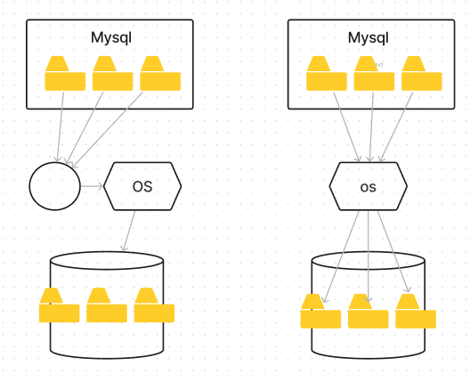

# 8.1 디스크 읽기 방식

### 8.1.1 하드 디스크 드라이브와 솔리드 스테이트 드라이브

* HDD는 상대적으로 속도가 느린 기계식 장치로 데이터베이스의 병목이 되었다.
* 이러한 단점을 극복하기 위해 전자식 저장 매체인 SSD로 대체하는데 HDD의 데이터 저장용 플래터(원판)을 제거하고 플래시 메모리를 장착하고 있다.

* 순차 I/O에서는 하드 디스크와 비슷한 성능을 보이나, 랜덤 I/O에서는 훨씬 빠른 속도를 보인다. 랜덤 I/O를 통해 작은 데이터를 읽고 쓰는 DB에 최적이다.

### 8.1.2 랜덤 I/O와 순차 I/O

랜덤 I/O는 HDD의 원판을 돌려서 읽어야 할 데이터가 저장된 위치로 디스크 헤더를 이동시킨 다음 데이터를 읽는 것을 의마한다. 

사실 순차 I/O 또한 작업 과정이 같으나 다른 점이 있다.

왼쪽이 순차I/O 오른쪽이 랜덤I/O이다

순차 I/O는 3개의 페이지를 디스크에 기록하기 위해 1번 시스템 콜을 요청하나 랜덤 I/O는 3개의 페이지를 디스크에 기록하기 위해 3번 시스템 콜을 사용하였다. 즉, 디스크에 기록하기 위해 순차I/O는 1번 디스크의 헤드를 움직였고, 랜덤I/O는 3번 디스크의 헤드를 움직여야 한다. 

디스크의 성능은 디스크의 헤드를 얼마나 적게 움직이느냐에 결정된다고 본다. 그래서 랜덤 I/O가 순차 I/O보다 부하가 크다.

