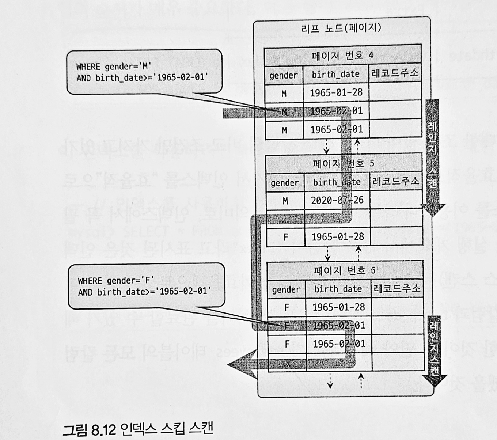
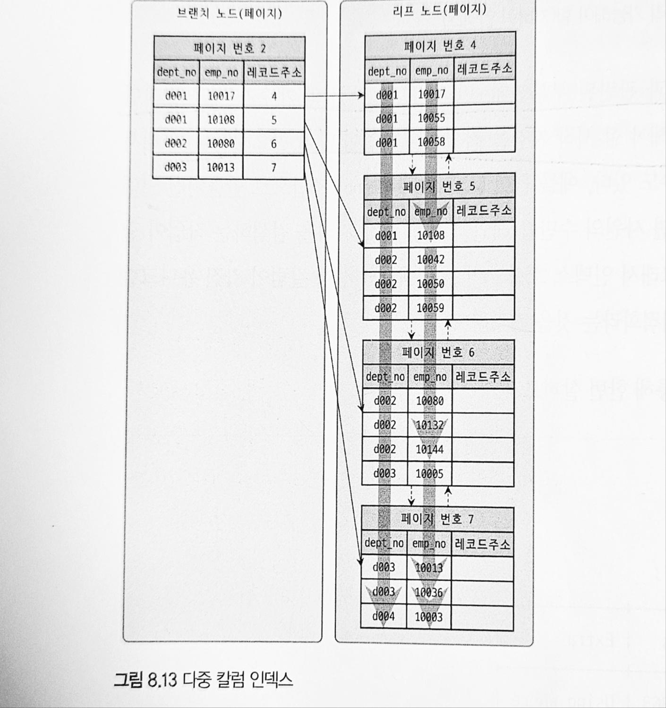
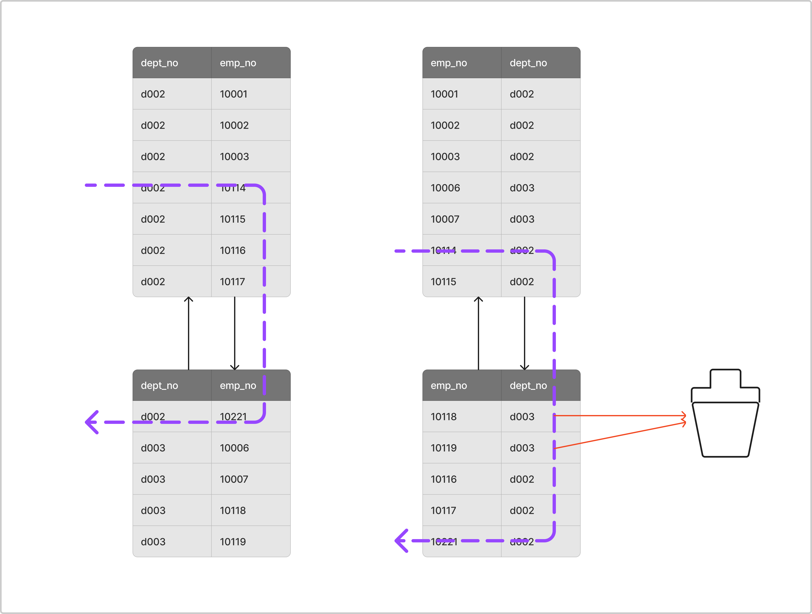

# 8.3 B-Tree 인덱스

B-Tree 는 데이터베이스 인덱싱 알고리즘 중 가장 일반적으로 사용되는 알고리즘이다. 
B-Tree 는 칼럼의 원래 값을 변형시키지 않고 인덱스 구조체 내에서는 항상 정렬된 상태로 유지한다.

### 8.3.1 구조 및 특성

B-Tree는 트리 구조의 최상위에 루트 노드가 존재 하고 그 하위에 자식 노드들이 붙어있는 형태이다.

트리 구조의 가장 하위에 있는 노드를 리프 노드라 하고 루트 노드와 리프 노드 사이에 있는 중간의 노드를 브랜치 노드라고 한다.

데이터베이스에서 인덱스와 실제 데이터가 저장된 데이터는 따로 관리되는데 인덱스의 리프 노드는 항상 실제 데이터 레코드를 찾아가기 위한 주솟값을 가지고 있다.

인덱스의 키 값은 모두 정렬되어 있으나 데이터 파일의 레코드는 정렬되어 있지 않다.

InnoDB에서는 인덱스를 통해 레코드를 읽을 때 바로 찾아가는 것이 아닌 인덱스에 저장되어 있는 프라이머리 키 값을 이용해 프라이머리 키 인덱스를 한번 더 검색하고 프라이머리 키 인덱스의 리프 페이지에 저장되어 있는 레코드를 읽는다.

### 8.3.2 B-Tree 인덱스 키 추가 및 삭제


#### 8.3.2.1 인덱스 키 추가

B-Tree에 값을 저장할 때는 저장될 키 값을 이용해 B-Tree상의 적절한 위치를 검색해야 한다.

저장될 위치가 정해지면 레코드의 키 값과 대상 레코드의 주소 정보를 B-Tree의 리프노드에 저장한다.

만약 리프노드가 꽉 차서 저장할 공간이 없다면 리프 노드를 분리해야 하는데 이는 상위 브랜치 노드까지 작업 범위가 넓어진다. -> 쓰기 작업에 시간이 오래 걸림

InnoDB 같은 경우 인덱스 키 추가 작업을 지연시킬 수 있으나 프라이머리 키나 유니크 키는 중복체크가 필요하여 지연이 불가능하다.

#### 8.3.2.2 인덱스 키 삭제

해당 키 값이 저장된 B-Tree의 리프노드를 찾아서 삭제 마킹을 한다.

이때 마킹된 인덱스 키 공간은 방치되거나 재활용 될 수 있다.

이 작업 또한 디스크 I/O작업이 필요하다


#### 8.3.2.3 인덱스 키 변경

B-Tree의 키 값 변경은 먼저 해당 키 값 삭제 후, 다시 새로운 키 값을 추가하는 형식으로 진행된다. 

InnoDB에서는 체인지 버퍼를 통해 지연처리 될 수 있다.

#### 8.3.2.4 인덱스 키 검색

인덱스 검색은 루트 노드부터 최종 리프 노드까지 이동하면서 비교 작업을 수행한다(트리 탐색)
인덱스를 이용한 검색은 100%일치 혹은 값의 앞부분만 일치하는 경우에만 사용이 된다.

인덱스의 키값이 변형된 후 비교되는 경우에는 B-Tree의 빠른 검색 기능을 사용할 수 없다.(함수/연산 수행 후 인덱스 검색 x)

레코드 잠금, 넥스트 키 잠금은 검색을 수행한 인덱스를 잠근 후, 테이블의 레코드를 잠그는 방식으로 구현되어 있어 UPDATE, DELETE 시 적절한 인덱스가 없는 경우 모든 레코드를 잠궈야 하는 사태가 발생할 수 있다.

### 8.3.3 B-Tree 인덱스 사용에 영향을 미치는 요소

#### 8.3.3.1 인덱스 키 값 크기

InnoDB 스토리지 엔진에서 디스크에 데이터를 저장하는 가장 기본단위를 페이지(혹은 블록)라고 하며, 디스크의 모든 읽기/쓰기의 최소 작업 단위가 된다.

또한 버퍼 풀에서 데이터를 버퍼링하는 최소 단위가 되기도 한다.

인덱스 또한 페이지 단위로 관리되며, 루트, 브랜치, 리프노드를 구분하는 기준도 페이지이다.

Mysql에서 B-Tree의 자식 개수는 인덱스의 페이지 크기와 키 값의 크기에 따라 달려 있다.

인덱스를 구성하는 키 값의 크기가 커지면 페이지 내에 저장할 수 있는 키의 개수는 줄어들게 되고 결과적으로 디스크에 접근하는 횟수가 증가하여 성능이 감소한다.

#### 8.3.3.2 B-Tree의 깊이

인덱스의 키 값의 크기가 커지면 하나의 페이지에 담을 수 있는 인덱스 키 값의 개수가 줄어들게 되고, 같은 레코드 건수라 할지라도 깊이가 더 깊어지게 된다.

깊이기 깊어지면 디스크 읽기가 더 많이 필요하게 된다.

### 8.3.3.3 선택도(기수성)

모든 인덱스 키 값 가운데 유니크한 값의 개수를 의미한다.
(성별 같은 경우는 선택도가 2이고 주민등록번호같은 경우는 대한민국 내 인구 수 만큼...)

인덱스는 선택도가 높을수록 검색 대상이 줄어들어 성능이 좋아진다.

#### 8.3.3.4 읽어야 하는 레코드의 건수

일반적인 DBMS의 옵티마이저에서는 인덱스를 통해 레코드1건을 읽는 것이 테이블에서 직접 읽는 것보다 4~5 배 정도 비용이 든다고 판단한다.

즉 인덱스에서 읽어야 하는 데이터의 개수가 전체 테이블 레코드 개수의 20~25% 를 넘어서면 인덱스를 사용하지 않는 것이 더 이득이다.

### 8.3.4 B-Tree인덱스를 통한 데이터 읽기

#### 8.3.4.1 인덱스 레인지 스캔

```sql
SELECT * FROM employees WHERE first_name BETWEEN 'Ebbe' AND 'Gad';
```

인덱스 레인지 스캔은 검색해야 할 인덱스의 범위가 결정되었을 때 사용하는 방식이다.

루트 노드에서부터 비교를 하여 리프 노드까지 내려가야 필요한 레코드의 시작점을 알 수 있다.

일단 시작 지점을 찾으면 리프 노드는 레코드만 순서대로 스캔하면 된다.


#### 8.3.4.2 인덱스의 풀 스캔

인덱스의 처음부터 끝까지 모두 읽는 방식

대표적으로 쿼리의 조건절에서 사용된 칼럼이 인덱스의 첫 번째 칼럼이 아닌경우 인덱스 풀 스캔 방식이 사용된다.

ex ) 인덱스가 A,B,C 칼럼의 순서로 만들어져 있으나 쿼리의 조건이 B,C 만 있는 경우

#### 8.3.4.3 루스 인덱스 스캔

듬성듬성 인덱스를 읽는 방법

중간에 필요하지 않은 인덱스 키값을 SKIP 하고 다음으로 넘어가는 방식으로 진행된다.

#### 8.3.4.4 인덱스 스킵 스캔

특정 칼럼 인덱스를 건너 뛰어 검색할 수 있는 방식이다



인덱스 스킵 스캔은 아래와 같은 제약 사항이 있다.
* WHERE 조건절에 조건이 없는 인덱스의 선행 컬럼의 유니크한 값의 개수가 적어야 한다.
* 쿼리가 인덱스에 존재하는 칼럼만으로 처리가능해야 한다.

### 8.3.5 다중 칼럼 인덱스

두개 이상의 칼럼으로 구성된 인덱스를 뜻한다.



사진을 보면 인덱스의 두번째 칼럼이 첫번째 칼럼에 의존해서 정렬되어 있다. (두 번째 칼럼의 정렬은 첫 번째 번째 칼럼이 똑한은 레코드에서만 의미 있음)

만약 컬럼이 4개가 있다면 세 번째 칼럼은 두 번째 칼럼에 의존하여 정렬될 것이고 네 번째 칼럼은 세 번째 칼럼에 의존하여 정렬될 것이다.

다중 칼럼 인덱스는 인덱스 내에서 각 칼럼의 위치가 상당희 중요하다.


### 8.3.6 B-Tree 인덱스의 정렬 및 스캔 방향

인덱스를 생성할 때 설정한 정렬 규칙에 따라서 인덱스의 키 값은 항상 오름차순/내림차순으로 정렬된다.

하지만 인덱스를 어떤 방향으로 읽을지는 옵티마이저의 실시간 실행 계획에 따라 결정된다.

#### 8.3.6.1 인덱스의 정렬

1. 인덱스의 스캔 방향   
Mysql 옵티마이저는 인덱스의 읽기 방향을 전환하여 사용하도록 실행 계획을 만들어낸다.

2. 내림차순 인덱스
* 인덱스 정순 스캔 : 인덱스 키의 크고 작음과 관계없이 인덱스 리프 노드의 왼쪽 페이지부터 오른쪽으로 스캔
* 인덱스 역순 스캔 : 인덱스 키의 크고 작음과 관계없이 인덱스 리프 노드의 오른쪽 페이지부터 왼쪽으로 스캔

InnoDB에서 인덱스의 역순 스캔은 정순 스캔 보다 느리다.  
이유는   
1. 페이지 잠금이 인덱스 정순 스캔에 적합한 구조
2. 페이지 내에서 인덱스 레코드가 단방향으로만 연결된 구조

이기 때문이다.

그러므로 쿼리에서 자주 사용되는 정렬 순서대로 인덱스를 생성해야 한다.

### 8.3.7 B-Tree 인덱스의 가용성과 효율성

#### 8.3.7.1 비교 조건의 종류와 효율성

다중 칼럼 인덱스에서 각 칼럼의 순서와 그 칼럼에 사용된 조건이 `=` 인지 `>` 혹은 `<` 인지에 따라 각 인덱스의 칼럼의 활용 형태가 달라진다.

```sql
SELECT * FROM dept_emp 
WHERE dept_no = 'd002' AND emp_no >= 10114;
```

이 쿼리를 위해 dept_emp 테이블에 각각의 칼럼의 순서만다른 두가지 케이스로 인덱스를 생성했다고 가정하자

* 케이스1 : INDEX (dept_no, emp_no)
* 케이스2 : INDEX (emp_no, dept_no)



케이스 1번은 `dept_no = 'd002' AND emp_no >= 10114`인 레코드를 찾고, 그 이후 `dept_no = 'd002'`가 아닐 때까지 인덱스를 쭉 읽기만 하면 된다. 

하지만 케이스 2번은 `emp_no >= 10114 AND dept_no = 'd002'` 인 레코드를 찾고 그 이후 모든 레코드에 대해 `dept_no = 'd002'`인지 비교하는 과정을 거쳐야 한다.

이처럼 인덱스를 통해 읽은 레코드가 나머지 조건에 맞는지 비교하면서 취사 선택을 하는 작업을 필터링이라고 한다.


케이스 1처럼 작업의 범위를 결정하는 조건을 작업 범위 결정 조건 이라고 하고 케이스 2처럼 비교 작업의 범위를 줄이지 못하고 단순히 거름종이 역할만 하는 조건을 필터링 조건이라고 한다.

#### 8.3.7.2 인덱스의 가용성

두개의 인덱스가 있다고 가정해보자

* 케이스 1 : INDEX (first_name)
* 케이스 2 : INDEX (dept_no, emp_no)

케이스 1의 인덱스가 지정된 employee 테이블에서 아래와 같은 쿼리문을 날린다고 가정해보자

```sql
SELECT * FROM employee WHERE first_name LIKE '%mer';
```

위와 같은 쿼리문은 인덱스 레인지 스캔 방식을 사용할 수가 없다.

first_name 컬럼에 저장된 값의 왼쪽부터 한 글자씩 비교해가면서 일치하는 레코드를 찾아야 하는데 `%mer`에는 왼쪽 부분이 고정되어 있지 않기 때문이다.

두 번째로 케이스 2의 인덱스가 지정된 dept_emp 테이블에서 아래와 같은 쿼리문을 날린다고 가정해보자

```sql
SELECT * FROM dept_emp WHERE emp_no >= 10144;
```

인덱스가 dept_no, emp_no 칼럼 순서대로 생성되어 있다면 선행 칼럼인 dept_no 조건 없이 emp_no값으로만 검색하면 인덱스를 효율적으로 사용할 수 없다.

#### 8.3.7.3 가용성과 효용성 판단

기본적으로 B-Tree 인덱스 특성상 아래와 같은 조건에서는 사용할 수 없다.

* Not-Equal로 비교된 경우(`<>`, `not in`, `not between`, `is not null`)
* LiKE '%??' 형태로 문자열 패턴 비교
* 스토어드 함수나 다른 연산자로 인덱스 칼럼이 변경된 경우
* NOT-DETERMINISTIC 속성의 스토어드 함수가 비교 조건에 사용된 경우
* 데이터 타입이 서로다른 비교(인덱스 컬럼 타입을 변환해야 하는 경우)
* 문자열 데이터 타입의 콜레이션이 다른 경우


